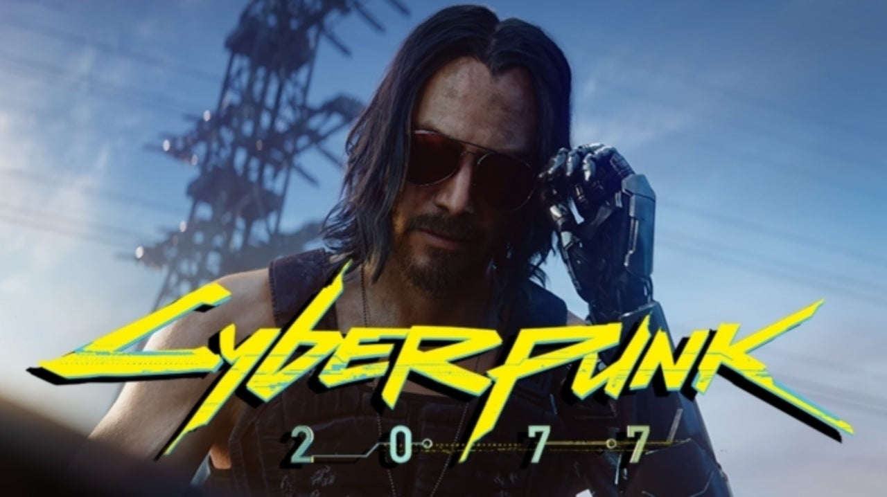

#Historia-Polskich-Gier-Komputerowych
<!DOCTYPE html>
<html lang="pl">
<head>
    <meta charset="UTF-8">
    <meta name="viewport" content="width=device-width, initial-scale=1.0">
    <title>Historia gier komputerowych</title>
    
</head>

<body>
 
    <header>

        <h1 class="logo">Historia Polskich Gier Komputerowych</h1>

        <nav>
        
            <ul class="menu">
                
                <li><a href="#główna">Strona Główna</a></li>
                
                <li><a href="#jak">Jak To Się Zaczeło?</a></li>
                
                <li><a href="#ppg">Popularne</a></li>
                
                <li><a href="#npg">Nadchodzące Gry</a></li>
            </ul>

        </nav>

    </header>
        
     <main>
        <article>
            <section>
                

                    <header>
                        
                        <h1><a name="główna">Witaj w świecie polskich gier!</a></h1>
                        
Gry komputerowe bez dwóch zdań powoli przejmują nasze życia. Stają się jego nieodrębną częścią, jak sport, czy też trafniej - jak e-sport.
                            Organizowane są różne turnieje z gier komputerowych, które są oglądane przez setki tysięy,
                            jeśli nie miliony osób na prawie całym świecie. Jeśli chcesz się dowiedzieć, jak to
                            wszystko się zaczeło to jesteś we właściwym miejscu.

                     </header>

                   

                        <figure>
                            
                         </figure>

                   

                
                    

                    <figure>
                        
                     </figure> 
                    

                

            </section>
            <section id="newest">
                

                    <header>
                         
                         
                        <h1><a name="jak">Jak to się zaczeło?</a></h1>
                    </header>
                

                        

                        
                        
  1962r. - wtedy wszystko się zaczęło. Inżynier Witold Podgórski właśnie w tym roku
                            stworzył ,,Marienbad" - chińsską grę logiczną, którą podejrzał w filmie ,,Zeszłego
                            roku w Marienbadzie". Każdą rozgrywkę rozpoczynał układ czterech rzędów 
                            zapałek, kolejno: jednej, trzech, pięciu i siedmiu. Gracz i komputer na przemian wyciągali
                            wybraną liczbę zapałek z dowolnego rzędu. Nie można było wyciągać zapałek z więcej niż jednego
                            rzędu naraz. Przegrywał ten, który został z ostatnią zapałką.Bieżący układ zapałek gracz 
                            obserwował na wydruku z dalekopisu (telegraficznego urządzenia drukującego). Ciekawostką jest
                            to, że nie dało się wygrać z komputerem. Można było w nią zagrać na komputerze Odra 1003,
                            produkowanym w zakładzie, w którym pracował autor gry.

                            
                            
                        

                        
                        
            </section>
        
            <section id="newest">
                <header>
                     
                     
                    <h1>Web Master - 1983r.</h1>
                </header>
                
                

                        
                    
Na kolejną grę musieliśmy czekać bardzo długo, bo aż 21 lat! Kolejną
                        polską grą jest Web Master stworzony
                     przez Piotra Bednawskiego, Jerzego Dybskiego oraz Jarosława Wyżgowskiego.
                     Gra została napisana na ośmiobitowe komputery Atari.
                     Pomysł na Web Mastera zaczerpnięto pośrednio z gry Pac-Man. bohaterem polskiego tytułu był 
                     pająk uciekający po utkanej pajęczynie przed owadami, naprawiający ubytki sieci i
                    zjadający żuki i muchy, za co otrzymywał punkty. Gra miała trzy poziomy trudności
                    

                        

            </section>
            <section id="newest">
                

                    <header>
                         
                         
                        <h1>Najeźdzcy Z Kosmosu - 1985r.</h1>
                    </header>
                

                

                        
                    
Gra została stworzona przez Andrzeja Pustowka na ten sam komputer co Web Master - 
                     na Atari. Gra polegała na tym, aby zestrzelić statki obcych atakujących Ziemię. 
                     Z każdym kolejnym poziomem dochodziły nowe funckje, np. strefy bezpieczeństwa czy 
                     zwiękoszona odporność na obrażenia.
                    

                        
                        
                    

            </section>
            <section id="newest">
                <header>
                     
                     
                    <h1>Magic Keys - 1985r.</h1>
                </header>
                

                        
                    
Magic Keys to produkcja Stefana Życzkowskiego, której celem było
                        przechodzenie kolejnych poziomów, które można było nazwać labiryntami. 
                        W drodze do mety trzeba było uważać na hordy przeciwników, poruszających 
                        się po mapie.

                    
 
                        

            </section>
            <section id="newest">
                

                    <header>
                         
                         
                        <h1>Puszka Pandory - 1986r.</h1>
                    </header>
                

                

                        
                    
Polska komputerowa gra tekstowa stworzona w 1986 roku przez Marcina Borkowskiego
                        na komputer ZX Spectrum. Fabuła była inspirowana powieścią ,,Głowa Kasandry" Marka
                        Baranieckiego. W grze gracz wcielał się w agenta specjalnego mającego zniszczyć 
                        wrogi system rakietowy na nieokreślonej wyspie. Postać była poruszana za pomocą 
                        zestawu komend. Gra po ukazaniu się na giełdach zyskała dużą popularność.
                    

                        
                        
                    

            </section>
            <section id="newest">
                

                    <header>
                         
                         
                        <h1>Inne starsze gry</h1>
                    </header>
                

                

                        
                    <ul class="reszta">
                        <li>Hibernatus - 1987r.</li>
                        <li>Metropolis 1 - 1987r.</li>
                        <li>Conan - Spotkanie w krypcie - 1987r.</li>
                        <li>Boks - 1987r.</li>
                        <li>Podróż po Polsce - 1987r.</li>
                        <li>Hexan - 1987r.</li>
                        <li>Gwiezdne Imperium - 1988r.</li>
                        <li>Mózgprocesor - 1989r.</li>
                        <li>Blockout - 1989r.</li>
                        <li>Street Rod - 1989r.</li>
                        <li>Tunnels of Armageddon - 1989r.</li>
                        <li>Misja - 1990r.</li>
                        <li>Street Rod 2 - 1991r.</li>
                        <li>Fred - 1991r.</li>
                        <li>Kult - 1992r.</li>
                        <li>Hans Kloss - 1992r.</li>
                        <li>Operation Blood - 1992r.</li>
                        <li>Patrol - 1992r.</li>
                        <li>Fire Power - 1993r.</li>
                        <li>Incydent - 1993r.</li>
                        <li>Adventures of Robbo - 1994r.</li>
                        <li>Książe - 1994r.</li>
                        <li>Janosik - 1994r.</li>
                        <li>Rooster - 1994r.</li>
                        <li>Mentor - 1994r.</li>
                        <li>Prawo Krwi - 1995r.</li>
                        <li>Dan Wilder - 1995r.</li>
                        <li>Project Battlefield - 1995r.</li>
                        <li>Legion - 1995r.</li>
                        <li>Misja Harolda - 1995r.</li>
                        <li>Astral - 1996r.</li>
                        <li>A.D. 2044 - 1996r.</li>
                        <li>Książe I Tchórz - 1998r.</li>
                        <li>Robbo Millenium - 2000r.</li>
                       
                       
                    </ul>                    
                        
                        
                    

            </section>

        </article>
  </main>   
        <article>
            

                <header>
                    <h1><a name="ppg">Popularne polskie gry</a></h1>

                 
Od lat 90. wiele się zmieniło w świecie tworzenia gier wideo.
                    Polscy deweloperzy są coraz bardziej doceniani na Zachodzie. 
                    Czas więc przyjrzeć się bliżej tym grą, które słyną na światowej gamingowej
                    scenie.
                    

                </header>  
                
                

                    <figure>
                        
                     </figure>

               

            
                

                <figure>
                    
                 </figure> 
                

            

             
             
            <section id="newest">
            <header>
                 
                 
                <h1>Ruiner</h1>
            </header>
            
            

                
                
Brutalny shooter, którego akcja toczy się w 2091 roku w cybermetropolii
                     Rengkok. Główny bohater jest socjopatą, który z pomocą tajemniczej hakerki
                      walczy ze skorumpowanym systemem, aby odkryć prawdę i uratować porwanego brata.
                    

                    
                 
                 
            </section>
            <section id="newest">
                    

                        <header>
                             
                             
                            <h1>We. the Revolution</h1>
                        </header>
                    

                    

                            
                        
Niepowtarzalna gra narracyjna, której akcja rozgrywa się w salach sądowych i na 
                            ulicach zrewoltowanego Paryża w czasach Rewolucji Francuskiej. Gracz wciela się w
                            role sędziego Trybunału Rewolucyjnego, wydaje wyroki w sprawie zwykłych mieszkańców miasta, rewolucjonistów i arystokracji.
                        

                            
                            
                        

                </section>
                <section id="newest">
                    

                        <header>
                             
                             
                            <h1>Observer</h1>
                        </header>
                    

                    

                            
                        
To gra przygodowa w konwencji horroru z akcją przedstawioną z pierwszej osoby. Przez większość czasu gracz przemierza mroczne lokacje i wchodzi w interakcje z napotkanymi postaciami.
                        

                            
                            
                        

                </section>
                <section id="newest">
                    

                        <header>
                             
                             
                            <h1>Wiedźmin 3: Dziki Gon</h1>
                        </header>
                    

                    

                            
                        
Fabularna gra akcji stworzona i wydana przez CD Projekt Red 19 maja 2015 na platformy Microsoft Windows, PlayStation 4 i Xbox One. Gra jest kontynuacją wydanego w 2007 roku Wiedźmina oraz Wiedźmina 2: Zabójców królów, który miał swoją premierę w 2011 roku.
                        

                            
                            
                        

                </section>
                <section id="newest">
                    

                        <header>
                             
                             
                            <h1>Frostpunk</h1>
                        </header>
                    

                    

                            
                        
Gra komputerowa łącząca w sobie elementy strategicznej gry czasu rzeczywistego, gry w budowę miasta i survivalu, osadzona w steampunkowym świecie, opowiadająca o walce społeczności o przetrwanie w zimowym klimacie, wyprodukowana przez 11 bit studios.
                        

                            
                            
                        

                        
                </section>
                <section id="newest">
                    

                        <header>
                             
                             
                            <h1>Superhot</h1>
                        </header>
                    

                    

                            
                        
Gra komputerowa łącząca w sobie elementy strategicznej gry czasu rzeczywistego, gry w budowę miasta i survivalu, osadzona w steampunkowym świecie, opowiadająca o walce społeczności o przetrwanie w zimowym klimacie, wyprodukowana przez 11 bit studios.
                        

                            
                            
                        

                        
                </section>
                <section id="newest">
                    

                        <header>
                             
                             
                            <h1>Dying Light </h1>
                        </header>
                    

                    

                            
                        
Seria survival horrorowych gier komputerowych wydawana przez polską firmę Techland. Główną tematyką gier z serii są starcia ocalałych od epidemii ludzi z zombie.
                        
 
                            
                        

                        
                </section>
                <section id="newest">
                    

                        <header>
                             
                             
                            <h1>This War of Mine</h1>
                        </header>
                    

                    

                            
                        

                            Gra opowiada o przetrwaniu w czasie wojny, wyprodukowana przez polskie studio 11 bit studios inspirowana oblężeniem Sarajewa.
                        

                    
                            
                            
                        

                        
                </section>
                <section id="newest">
                    

                        <header>
                             
                             
                            <h1>Shadow Warrior 2</h1>
                        </header>
                    

                    

                            
                        

                            Shadow Warrior 2 to kontynuacja pierwszoosobowej gry akcji z 2013 roku, stworzona przez rodzimego dewelopera Flying Wild Hog. Polski zespół jako inspirację pierwszej odsłony tytułu wykorzystał szaloną strzelankę z 1997 roku o tej samej nazwie.
                        

                    
                            
                            
                        

                        
                </section>
                <section id="newest">
                    

                        <header>
                             
                             
                            <h1>Zaginięcie Ethana Cartera</h1>
                        </header>
                    

                    

                            
                        

                            Fabuła gry skupia się na posiadającym nadprzyrodzone zdolności detektywie Paulu Prospero prowadzącym śledztwo w fikcyjnej Red Creek Valley. Prospero przybywa do niej po otrzymaniu listu od chłopca imieniem Ethan Carter twierdzącego, że znajduje się w niebezpieczeństwe. Zadaniem detektywa jest zbadanie Red Creek Valley i jej mrocznych sekretów.
                        

                    
                            
                            
                        

                        
                </section>

        </article>
        <article>
            

                <header>
                    <h1><a name="npg">Nadchodzące polskie gry</a></h1>

                 
Parę lat temu, w branży gier, prawie nikt nie liczył się z polskimi twórcami, którzy robili, po prostu przeciętne gry.
                     Czasy się zmieniły, a Polacy robią produkcje, które kradną serca milionów
                     graczy. Jakie są najbliższe premiery polskich gier?
                    

                </header>  
                
                

                    <figure>
                        
                     </figure>

               

            
                

                <figure>
                    
                 </figure> 
                

            

             
             
            <section id="newest">
                

                    <header>
                         
                         
                        <h1>Outriders</h1>
                    </header>
                

                

                        
                    

                        Outriders to gra od studia People Can Fly. Outriders będzie kooperacyjną strzelanką osadzoną w klimacie mrocznego science fiction. Akcja rozegra się w Enochu, który, według twórców, jest bardzo brutalnym miejscem. 
                        Wcielimy się w członków załogi statku kosmicznego, którzy odebrali tajemniczy sygnał. Zostaną oni sprowadzeni na planetę, na której wykonamy różne misje. W trakcie ich wykonywania, będziemy narażeni na niebezpieczeństwo ze strony nieznanych potworów zamieszkujących Enochu.
                    

                
                        
                        
                    

                    
            </section>
            <section id="newest">
                

                    <header>
                         
                         
                        <h1>Bum Simulator</h1>
                    </header>
                

                

                        
                    

                        Bum Simulator to gra, która humorystycznie odtwarza życie menela - na taki pomysł wpadło studio Ragged Games, dla których będzie to pierwsza gra na rynku.
                        Wcielimy się w miejscowego bezdomnego, który w pewnym momencie traci cały swój dobytek. Do naszej dyspozycji zostanie oddane wiele możliwości, począwszy od zwykłego zbierania pieniędzy do kubeczka na "ślepego", aż do uczciwego zarabiania w pracy.
                    

                
                        
                        
                    

                    
            </section>
            <section id="newest">
                

                    <header>
                         
                         
                        <h1>Witchfire</h1>
                    </header>
                

                

                        
                    
Witchfire to nadchodząca strzelanka FPS opracowana przez polskie niezależne studio The Astronauts dla Microsoft Windows.
                    

                
                        
                        
                    

                    
            </section>
            <section id="newest">
                

                    <header>
                         
                         
                        <h1>Ghostrunner</h1>
                    </header>
                

                

                        
                    
Ghostrunner to cyberpunkowa gra akcji z widokiem z perspektywy pierwszej osoby, za którą jest odpowiedzialne studio One More Level.
                        Trafiamy do zniszczonego w wyniku globalnego kataklizmu miasta. Niedobitki ludzkości funkcjonują w wielkiej wieży skonstruowanej przez nieżywego już Architekta, którego śmierć wywołała ogromny chaos. Władzę przejął Klucznik, a jego rządy nie podobają się mieszkańcom, którzy próbują odsunąć go od sprawowania rządów. 
                        Wcielamy się w bohatera obdarzonego nadnaturalnymi zdolnościami i jest to jedyny człowiek, który może położyć kres twardym rządom Klucznika.
                    

                
                        
                        
                    

                    
            </section>
            <section id="newest">
                

                    <header>
                         
                         
                        <h1>Dying Light 2</h1>
                    </header>
                

                

                        
                    
Dying Light 2 to gra akcji w otwartym świecie wykreowanym przez studio Techland. Produkcja jest kontynuacją hitu z 2015 roku, a jej akcja toczy się 15 lat po historii opowiedzianej w pierwszej części.
                        Trafimy do europejskiego miasta opanowanego przez niebezpieczne zombie, a naszym głównym zadaniem, podobnie jak w Dying Light, będzie przetrwać i nie dać się zarazić wirusem, który zmienia zdrowych ludzi w zombie.
                        Warto zaznaczyć, że twórcy chcą pozwolić nam budować swoją własną opowieść - przyjdzie nam podejmować bardzo ważne decyzje, od których będzie zależeć los innych ludzi.
                    

                
                        
                        
                    

                    
            </section>
            <section id="newest">
                

                    <header>
                         
                         
                        <h1>Cyberpunk 2077</h1>
                    </header>
                

                

                        
                    
Cyberpunk 2077 to jedna z najbardziej wyczekiwanych gier 2020 roku. Jak wskazuje tytuł, akcja gry przeniesie nas do 2077 roku i będzie rozgrywać się w cyberpunkowym mieście Night City, przesączonym ludźmi o elektronicznych implantach. 
                        Wcielamy się w stworzonego przez nas bohatera o imieniu V, młodego najemnika lub najemniczkę, który dopiero co wchodzi w świat megakorporacji. Sprawy się komplikują, kiedy to podczas zlecenia, V znajduje czip skrywający sekret nieśmiertelności, którego pragnie każdy liczący się człowiek w Night City.
                    

                
                        
                        
                    

                    
            </section>
        </article>
    <footer>
        <header id="stopa">
            <h5>©2020 Historia Polskich Gier komputerowych</h5>
        </header>
        

             
             
            
             
          
        

        

            
Icons made by <a href="https://www.flaticon.com/authors/freepik" title="Freepik">Freepik</a> from <a href="https://www.flaticon.com/" title="Flaticon"> www.flaticon.com</a>

            
Icons made by <a href="https://www.flaticon.com/authors/ddara" title="dDara">dDara</a> from <a href="https://www.flaticon.com/" title="Flaticon"> www.flaticon.com</a>

            
Icons made by <a href="https://www.flaticon.com/authors/freepik" title="Freepik">Freepik</a> from <a href="https://www.flaticon.com/" title="Flaticon"> www.flaticon.com</a> 

            
Icons made by <a href="https://www.flaticon.com/authors/pixel-perfect" title="Pixel perfect">Pixel perfect</a> from <a href="https://www.flaticon.com/" title="Flaticon"> www.flaticon.com</a> 

            
Icons made by <a href="https://www.flaticon.com/authors/freepik" title="Freepik">Freepik</a> from <a href="https://www.flaticon.com/" title="Flaticon">www.flaticon.com</a>

            
Icons made by <a href="https://www.flaticon.com/authors/pixel-perfect" title="Pixel perfect">Pixel perfect</a> from <a href="https://www.flaticon.com/" title="Flaticon">www.flaticon.com</a>

            
Icons made by <a href="https://www.flaticon.com/authors/those-icons" title="Those Icons">Those Icons</a> from <a href="https://www.flaticon.com/" title="Flaticon">www.flaticon.com</a>

            
Icons made by <a href="https://www.flaticon.com/authors/pixel-perfect" title="Pixel perfect">Pixel perfect</a> from <a href="https://www.flaticon.com/" title="Flaticon">www.flaticon.com</a>

        

    </footer>   

</body>
</html>
